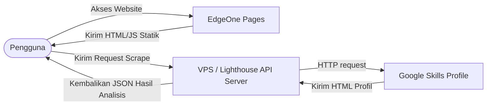

# Panduan Deployment Hybrid (EdgeOne Pages + VPS/Lighthouse)

Dokumen ini menjelaskan cara men-deploy proyek **Arcade Tracker** dengan arsitektur hybrid:
1. **Frontend (Astro)** di-host di **Tencent Cloud EdgeOne Pages** (hosting statik global berbasis CDN).
2. **Backend API (Python + httpx + lxml)** di-host di server konvensional (seperti **Tencent Cloud Lighthouse**, VPS, Docker, Render, dll.) untuk mengambil dan mem-parse profil publik.

---

## Arsitektur Aliran Data



---

## Langkah 1: Deploy Backend API

Karena API menggunakan Python, `httpx`, dan `lxml`, backend bisa dijalankan sebagai service ringan tanpa headless browser. Dependency dikelola melalui `uv`, bukan instalasi Python global.

### Opsi A: Menggunakan Docker (Direkomendasikan untuk VPS/Lighthouse)
Jika Anda ingin menjalankan via kontainer, gunakan `api/Dockerfile` yang sudah memakai `uv` dan virtual environment terisolasi.

1. Buat kontainer dan jalankan:
   ```bash
   docker build -f api/Dockerfile -t arcade-tracker-api .
   docker run -d -p 3001:3001 --name arcade-api arcade-tracker-api
   ```
2. Pastikan port `3001` terbuka di firewall server Anda.

### Opsi B: Jalankan Manual di Server
1. Clone repositori ke server Anda.
2. Dari root repositori, buat virtual environment dan install dependensi dengan `uv`:
   ```bash
   uv sync --frozen --no-dev
   ```
3. Jalankan server (gunakan systemd, supervisor, atau process manager lain agar berjalan di background):
   ```bash
   uv run --no-sync python -m api.server
   ```

Setelah berhasil, uji API Anda melalui browser: `http://<IP-SERVER-ANDA>:3001/api/health`.

---

## Langkah 2: Deploy Frontend ke EdgeOne melalui CLI

CLI EdgeOne melakukan direct upload terhadap folder `dist/`. Jalankan dari
root repositori:

```powershell
npx edgeone whoami
$env:PUBLIC_API_URL = "https://api.domain-anda.com"
npm run build
npx edgeone makers deploy dist --name arcade-tracker --env production --area global
```

Untuk Linux/macOS, gunakan `export PUBLIC_API_URL=...` sebagai pengganti
`$env:PUBLIC_API_URL`. Nilai `PUBLIC_API_URL` dibaca saat build Astro, sehingga
harus diset sebelum `npm run build`.

Untuk deployment CI/CD tanpa login interaktif, gunakan token EdgeOne:

```bash
npx edgeone makers deploy dist \
  --name arcade-tracker \
  --env production \
  --area global \
  --token "$EDGEONE_API_TOKEN"
```

Gunakan URL HTTPS untuk `PUBLIC_API_URL` pada production. Jika backend masih
berjalan pada port `3001`, arahkan domain API atau reverse proxy HTTPS ke port
tersebut; browser akan memblokir request HTTP dari halaman EdgeOne HTTPS.

---

## Langkah 3: Konfigurasi CORS (Opsional)

Secara bawaan, file `api/server.py` mengizinkan akses CORS dari semua origin.
Untuk keamanan di lingkungan produksi, Anda disarankan untuk membatasi origin hanya dari domain EdgeOne Pages Anda:

Set environment variable berikut pada server backend:

```bash
ALLOWED_ORIGIN=https://domain-edgeone-anda.example.com
```

Restart backend setelah mengubah konfigurasi CORS.
